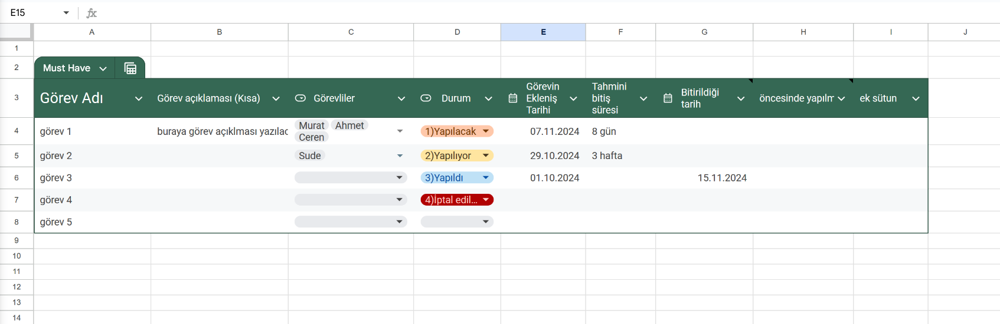
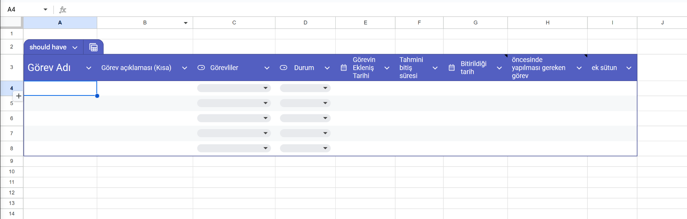
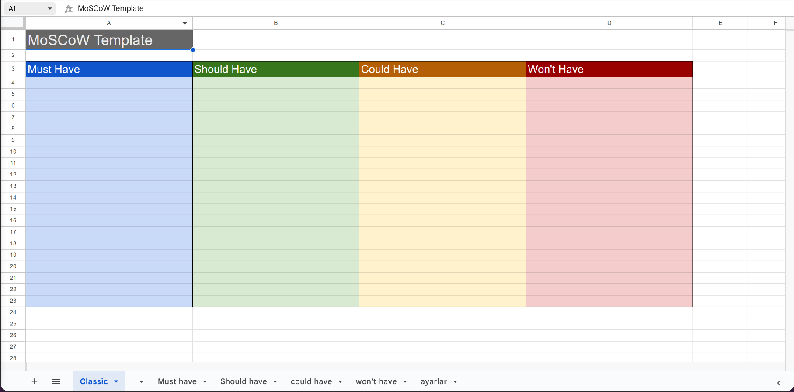


# MoSCoW Şablonu
Görev önceliklendirme sistemi olan MoSCoW Sistemi için Google Sheets'de çalışan şablon.

## Açıklama
Bu çalışma kapsamında moscow sisteminin düzgün bir şekilde uygulanabilmesi amaçlanmaktadır.

MoSCoW 4 bileşeni (must have, should have, could have, won't have) için ayrı sayfalar oluşturulmuştur. Ayarlar sayfası aracılığı ile bazı özelleştirmeler yapılabilir.

## [Şablon Link](https://docs.google.com/spreadsheets/d/109R7L9u8PqG7lOOrdiAIecKkYBTDU6EEhp2G4jxU6eQ/edit?usp=sharing)

### Not
Bu şablon sadece Google Sheets'de kullanılabilir. Başka araçlar ile kullanıldığında şablonda bozulmalar meydana gelmektedir.

