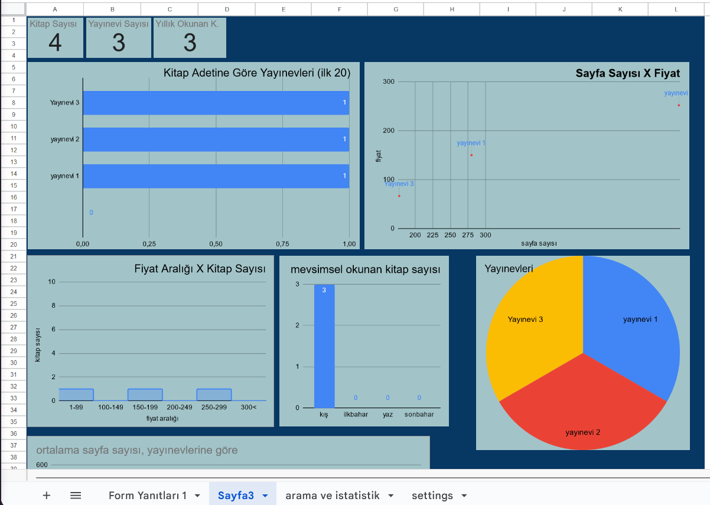
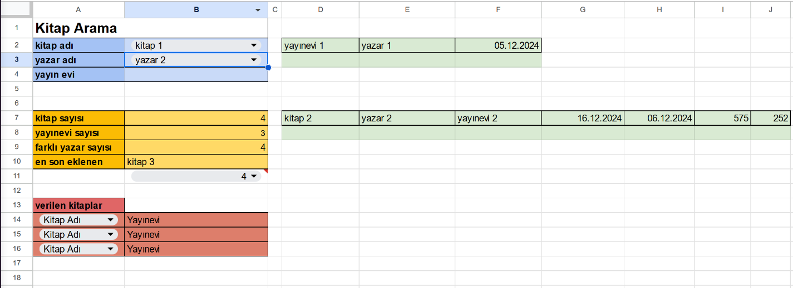



# Kitaplık Projesi
Kendi kütüphane uygulaması projemi yaptım.

## Açıklama
Bu çalışmada okuduğum kitapları kaydedip, okuma alışkanlıklarımı analiz edebilmek için kendi kütüphane uygulamamı yaptım.

Proje 4 sayfadan oluşuyor. Girdi sayfası, grafikler sayfası, arama sayfası, ayarlar sayfası. 

## [Şablon Link](https://docs.google.com/spreadsheets/d/13PT8AYSMPzdmpcXMG7iIUD0wHE-yAfolxvy2EitpDZo/edit?usp=sharing)

### Not
Bu proje sadece Google Sheets'de kullanılabilir. Başka araçlar ile kullanıldığında şablonda bozulmalar meydana gelebilmektedir.
Dosyanın kopyasını oluşturup siz de kullanabilirsiniz.
